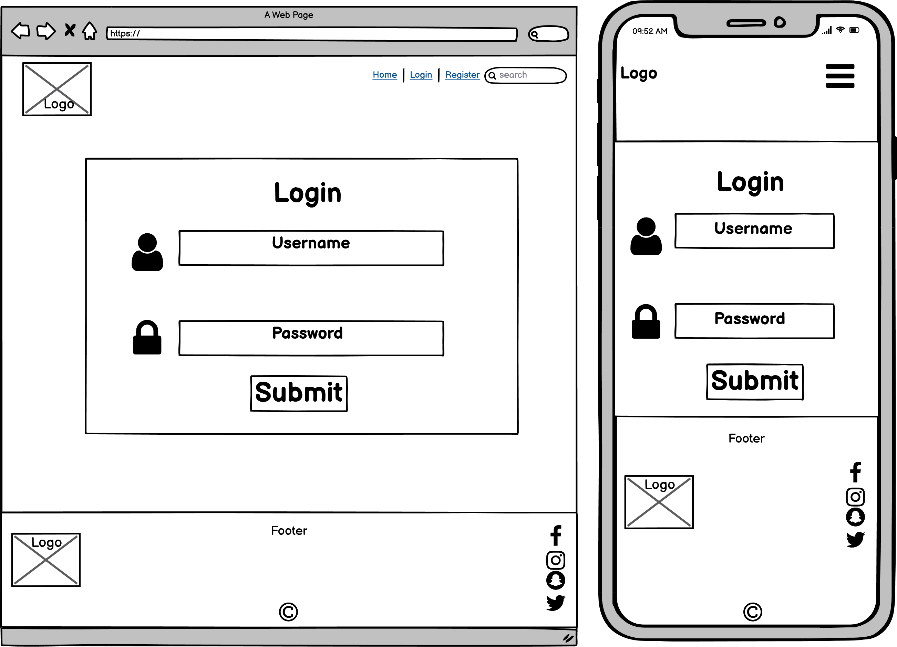
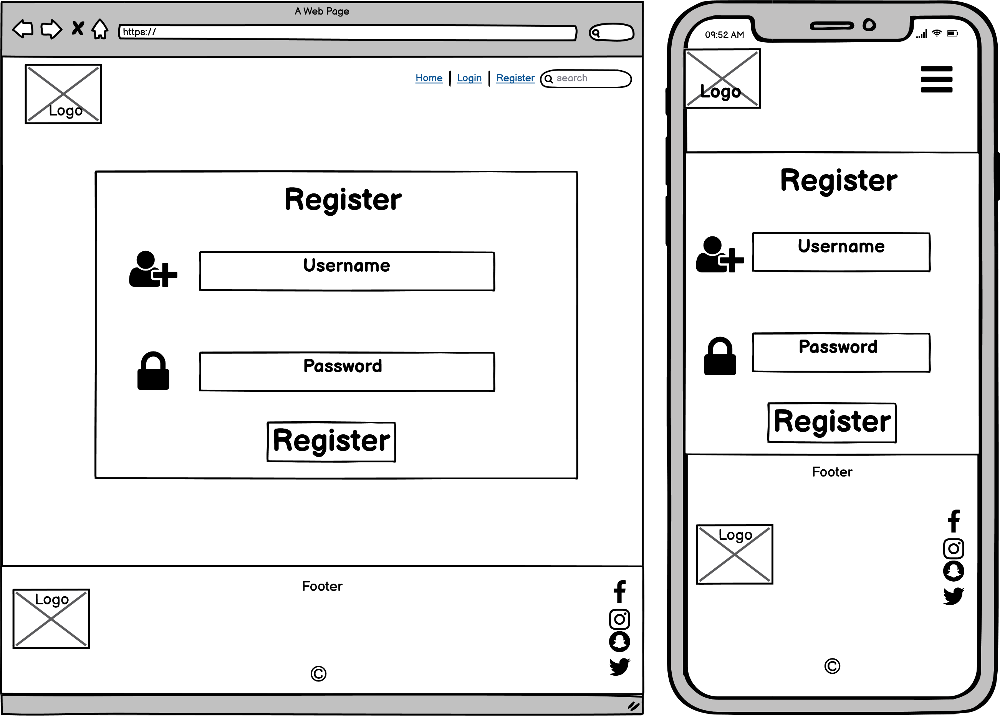

# Table of Contents
1. [Overview](#Overview)
2. [User Experience](#UX-(UserExperience))

   - [User Stories](##UserStories)
      - First Time Visitor Goals
      - Returning Visitor Goals
      - Developer Goals

   - [Structure](##Structure)
   - [Skeleton](##Skeleton)
   - [Wireframes](##Wireframes)

3. [Design](#Design)
      - Colour Scheme
      - Fonts
      - Imagery

4. [Features](#Features)

5. [Languages Used](#LanguagesUsed)

6. [Frameworks, Libaries, Tools](#FrameworksLibariesTools)

7. [Testing](#Testing)

8. [Deployment](#Deployment)

9. [Credits](#Credits)

## Overview

Books is a site that allows users to keep a log of the books they have read and share their log through reviews with others. 
Users who do not want to register to the site will be able to view the books that have been reviewed. 
When a user decides to register, they will be able to log books they have read and share their review.

# User Experience

### User Stories
    - As a user, I want to be able to register to Books using an email and password, log in and review a book I have read
    - As a user, I want to be able to search the site to find other reviews
    - As a user, I want an easy to navigate around site 
    - As a user, I want to be able to access Books's social media accounts
    - As a user, I want the structure of the site to be easy on the eye
    - As a user, I want to be able securely log out of Books
    - As a user, I want to be able to access the site on all devices
### First Time Visitor Goals
    - A simple and responsive navigation throughout the site
    - To be able to register to Books
    - To be able to login and post a review
### Returning Visitor Goals
    - To be able to search for reviews
    - To be able to post mutiple book reviews
### Developer Goals
    - To create a database 
    - To be able to add, edit and delete book reviews
    - To create a responsive, clean and consistent UX 

## - Structure

### User Story:

> As a user, I want to be able to register to Books using an email and password, log in and review a book I have read

    Criteria
        - Site must have a database that is fully functional 

    Implementation
        - Install mongodb database

### User Story:

> As a user, I want to be able to search the site to find other reviews

    Criteria
        - Have a search bar that is functional with the database

    Implementation
        - Add in a search bar that is functional with the database 

### User Story:

> As a user, I want an easy to navigate around site

    Criteria
        - Add a navigation manu
        - Have a Register and Login page
        - Display the book reviews in a structured layout on the home page

    Implementation
        - The UI/UX for the site has to be consistent and clean in order to achieve this 
    
### User Story:

> As a user, I want to be able to access Books's social media accounts

    Criteria
        - Have the site's social media links displayed in the footer

    Implementation
        - Add social media icons in the footer section of the site 

### User Story:

> As a user, I want the structure of the site to be easy on the eye

    Criteria
        - Have a clean UI/UX

    Implementation
        - Have a consistent UI/UX design throughout the site
        - Keeping the colour theme and font simple and consistent throughout the site

### User Story:

> As a user, I want to be able securely log out of Books

    Criteria
        - Have a functional database that allows users to register using their email and password 

    Implementation
        - Implement mongoDB and Flask into the project to link the project together

### User Story:

> As a user, I want to be able to access the site on all devices
    
    Criteria
        - Have the site responsive across all device platforms

    Implementation
        - The site will be designed with a mobile first approach to ensure all webpages is working unblemsihed across mobile, tablet and computer screen devices
## - Skeleton
The naigation menu will contiain the following pages:
    - Home - home.html
    - Register - register.html
    - Login - login.html

## - Wireframes

**Home**

**Login**

**Register**

## Design
#### Colour Scheme

#### Fonts
I will use the 'Courier' font family for the body of the site. This will give it a professional feel and suit the site's aims.  

#### Imagery

## Features

## Languages Used
    1. HTML
    2. CSS
    3. Python
## Frameworks, Libaries, Tools
    - Flask
    - Heroku
    - mongoDB

## Testing

**Heroku**
 1. **First initial deployment to heroku failed due to the UTF encoding. After changing to 'Save with encoding', I managed to successfully deploy to Heroku**

    

2. **Successful deployment**

    

3. **Application error #1**

    Upon successfully deployment, I encountered an 'Application error' for my deployment link. I found that upon looking into my heroku log, ***error code=h10*** would come up. 
    

    ### Registration page
    Upon first testing to see if my registration page was working, I encontered a Typo error which stated, 
    **"rn dumps rv = _json.dumps(obj, kwargs)"**
    
     
    However, I successfully mananged to connect my Mongo collections to my registration page. 
    
## Deployment
    https://ms3-books.herokuapp.com/

## Credits