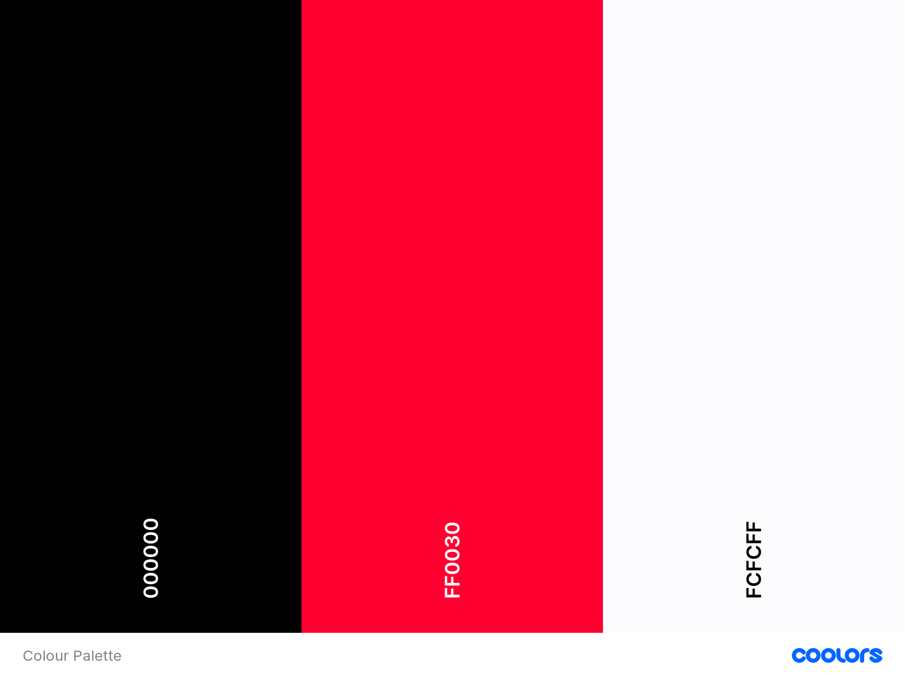
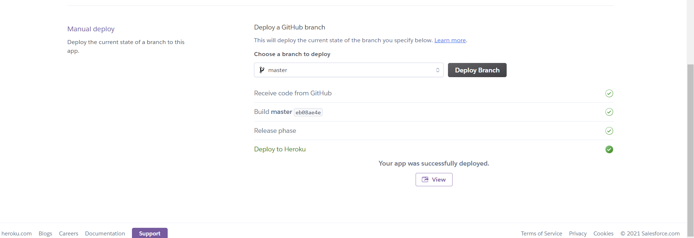

# Table of Contents

1. [Overview](#Overview)
2. [User Experience](<#UX-(UserExperience)>)

- [User Stories](##UserStories)
  - First Time Visitor Goals
  - Returning Visitor Goals
  - Developer Goals

- [Structure](##Structure)
- [Skeleton](##Skeleton)
- [Wireframes](##Wireframes)

3. [Design](#Design)

   - Colour Scheme
   - Fonts
   - Imagery
   - Back-end Design
   - Front-end Design

4. [Features](#Features)

5. [Languages Used](#LanguagesUsed)

6. [Frameworks, Libaries, Tools](#FrameworksLibariesTools)

7. [Testing](#Testing)

8. [Deployment](#Deployment)

9. [Credits](#Credits)

# Overview


**Books** is a site that allows users to keep a log of the books they have read and share their log through reviews with others.
Users who do not want to register to the site will be able to view the books that have been reviewed.
When a user decides to register, they will be able to log books they have read and share their review.

# User Experience

### User Stories

- As a user, I want to be able to register to Books using an email and password, log in and review a book I have read
- As a user, I want an easy to navigate around site
- As a user, I want the structure of the site to be easy on the eye
- As a user, I want to be able securely log out of Books
- As a user, I want to be able to access the site on all devices
### First Time Visitor Goals

- A simple and responsive navigation throughout the site
- To be able to register to Books
- To be able to login to Books
- To be able to post a book review to Books
- To be able to log out of Books
### Returning Visitor Goals

- To be able to post mutiple book reviews

### Developer Goals

- To create a database with MongoDB
- To implement CRUD funtionality
- To create a responsive, clean and consistent UX
- To not allow users to edit/delete other users book reviews 

### Structure

```
As a user, I want to be able to register to Books using an email and password, log in and review a book I have read
```

Criteria

- Site must have a database that is fully functional

Implementation

- Install Mongo DB database

```
As a user, I want an easy to navigate around site
```

Criteria

- Add a navigation manu
- Have a Register and Login page
- Display the book reviews in a structured layout on the home page

Implementation

- The UI/UX for the site has to be consistent and clean in order to achieve this

```
As a user, I want to be able to access Books's social media accounts
```

Criteria

- Have the site's social media links displayed in the footer (For the purpsoe of this project, the links in the footer won't be live)

Implementation

- Add social media icons in the footer section of the site

```
As a user, I want the structure of the site to be simplistic**
```

Criteria

- Have a clean UI/UX with matching colours

Implementation

- Have a consistent UI/UX design throughout the site
- Keeping the colour theme and font simple and consistent throughout the site

```
As a user, I want to be able to access the site on all devices
```

Criteria

- Have the site responsive across all device platforms

Implementation

- The site will be designed with a mobile first approach to ensure all webpages is working unblemsihed across mobile, tablet and computer screen devices

## - Skeleton

The naigation menu will contiain the following pages:

- Home | home.html
- Register | register.html
- Login | login.html
- Account | account.html

When the user has successfully registered and logged in the,
the navigation menu will consist of:

- Add Book Review | add_book.html
- Log Out

## - Wireframes

**Home**


**Login**


**Register**


# Design

### Colour Scheme

I've chosen three colours to keep the UI/UX clean and keep the colour scheme of the site consistent by adding this colours to the navbar, footer, login and registration pages.

I've gone with:

- #000000 | Black
- #FCFCFF | White
- #FF0030 | Light Orange



### Fonts

I will use the 'Courier' font family for the body of the site. This will give it a professional feel and suit the site's aims.

### Imagery

I've adopted the logo to have two colour schemes for the site. As the logo will be displayed in the navbar, and the navbar is black, the logo will be white.


The logo will also be displayed on the main home page. As the background of the home page is white, the logo will be black.


### Back-end design

- The app is created using Python3 and a Flask framework to render the HTML pages.
- The site is deployed via a Heroku app linked to a GitHub repository.
- The dynamic content is served using a MongoDB database.

### Front-end design

When the user has successfully posted their book review, it will be displayed in a card format which will include the book cover and details of the book. The site will require the user to paste a link of the book cover when adding the book review.

# Features

### Main Features

-	Responsiveness – The site is fully responsive to all screen sizes. 

-	Navbar and footer – The navbar and footer will be the same throughout the entire site, with the same links and information across all pages. The will both sit at the top and bottom of each page respectively, and will not scroll up or down with the user. This gives the user more screen space to view the site. I went with CSS for both my navbar and footer and added a hamburger to my navbar for mobile responsiveness. 

-	Flash messages – Flash messages are there to provide the user with feedback once registered, logged in, logged out etc.
### Home Page

-	Logo – The home page features the site logo in black to compensate the white background.

-	Book Review Cards – I used CSS to help display the book reviews submitted to the site. Each of these cards has the same layout; Book image, and the review information. Each card is the same size; this is to make sure that there are no spacing errors, as the book images may be different sizes when added by a user. 

-	Buttons – On each review card, there is delete and edit button. The Delete and Edit buttons will only be available to view by the user that has created them.
### My Account

-	My Reviews – The user will have their own book reviews here, and they will be in the same display format as on the Home page. This is so each user has quick and easy access to all reviews they have posted, and they can be easily edited from here. If the user has not yet left any reviews, the page will display a blank page with the heading 'My Reviews'

### Add/Edit Book Review, Register/Log In Pages

-	Forms – The forms on these pages are clear and concise, and responsive across all screen sizes. 
# **Languages Used**

- [HTML5](https://developer.mozilla.org/en-US/docs/Web/HTML)
Used as the main markup language for the website content.

- [Python3](https://www.python.org/)
Used to create the main application functionality

- [CSS3](https://developer.mozilla.org/en-US/docs/Web/CSS)
Used to style the individual webpages.

# **Frameworks, Database, Tools**

**Libraries**
- [Flask](https://www.fullstackpython.com/flask.html)
Python web framework

- [Werkzeug](https://werkzeug.palletsprojects.com/en/1.0.x/)
A comprehensive WSGI web application library installed with Flask

- [PyMongo](https://pymongo.readthedocs.io/en/stable/)
PyMongo is a Python tool for working with MongoDB

- [Flask-Pymongo](https://flask-pymongo.readthedocs.io/en/latest/)
Flask-PyMongo bridges the gap between Flask and PyMongo

**Database**
- [MongoDB Atlas](https://www.mongodb.com/)
Cloud based document-oriented database used to store the backend data.

**Tools**
- [Visual Studio Code](https://code.visualstudio.com/)
Visual Studio Code was used for the creation of this site.

- [Adobe Logo Maker](https://www.adobe.com/express/create/logo)
Adobe logo maker was used for the creation of the logo

**Deployment**
- [Heroku](https://www.heroku.com/)
Heroku is a platform as a service (PaaS) that enables developers to build, run, and operate applications entirely in the cloud.

# Testing

Find the full Testing Document [here!](TESTING.md)

[Back to contents](#table-of-contents)

# Deployment
#### Creation of a Python Virtual Environment ####

*Note: The process may be different depending upon your own OS - please follow this [Python help guide](https://python.readthedocs.io/en/latest/library/venv.html)
to understand how to create a virtual environment*

#### Install the App dependencies and external libraries ####

- In your IDE terminal window, install the dependencies from the requirements.txt file with the following command:

```
pip install -r requirements.txt
```

#### Create the database in MongoDB #####

*Please ensure you have an account created at [MongoDB](https://account.mongodb.com/) in order to build the database*

- In your MongoDB cluster, create a new database called `books-ms3`
- Create the following collections within the new database:
  - [books](wireframes/data-schemas/books.json)
  - [genres](wireframes/data-schemas/genres.json)
  - [users](wireframes/data-schemas/users.json)

 #### Create `env.py` file ####

- The `env.py` file should contain at least the following information:

```
import os

os.environ.setdefault("IP", "0.0.0.0")
os.environ.setdefault("PORT", "5000")
os.environ.setdefault("SECRET_KEY", "YOUR_OWN_SECRET_KEY")
os.environ.setdefault("MONGO_URI", "YOUR_OWN_MONGODB_URI")
os.environ.setdefault("MONGO_DBNAME", "YOUR_OWN_MONGODB_DATABASE_NAME")
```

- Please ensure you add in your own `SECRET_KEY`, `MONGO_URI` and `MONGO_DBNAME` values.
- ***Important:*** Add the `env.py` file to your `.gitignore` file before pushing your files to any public git repository.

#### Run the application ####

- To run the application enter the following command into the terminal window:

```
python3 app.py
```

### **Deploying Books-MS3 app to Heroku** ###

#### Create the Heroku App ####

*Ensure you have an account created at [Heroku](https://signup.heroku.com/login) in order to deploy the app*

- Log in to your Heroku account dashboard and create a new app.
- Enter the App name. 
  - This needs to be unique and books-ms3 is already in use so choose a suitable alternative name for your own App.
- Choose a geographical region closest to where you live.
  - Options available on a free account are ***United States*** or ***Europe***

#### Push your repository to GitHub ####

- Commit and push your local repository to your GitHub linked repsitory

- Ensure your local git repository has the following files in the root directory:

  - Heroku `Procfile`
  - `requirements.txt`

- If these are not showing in your local Git repository for any reason, enter the following commands in the terminal window:

```
echo web: python app.py > Procfile
pip3 freeze --local > requirements.txt
```

- Stage, commit and push your local Git repository to GitHub

#### Connect Heroku to GitHub ####

- In the Heroku App Settings page, open the section Config Vars
- Add all the environmant variables from your local `env.py` file into the Heroku Config Vars:


| Key | Value |
| --- | --- |
| IP | 0.0.0.0 |
| PORT | 5000 |
| SECRET_KEY | YOUR_OWN_SECRET_KEY |
| MONGO_URI | YOUR_OWN_MONGODB_URI |
| MONGO_DBNAME | YOUR_OWN_MONGODB_DATABASE_NAME |

- In the Heroku App Deploy page: 
  - Select GitHub from the Deployment Method options.
  - Select Connect to GitHub.
  - Log in to your GitHub account from Heroku to link the App to GitHub.
  - Search for and select the repository to be linked in Github.
  - Select Connect.
  - Select Enable Automatic Deployment from the GitHub Master / Main branch
#### Launch the App ####

- Click Open App in Heroku to launch the App in a new browser window.

**Successful deployment**

# Credits

- **Code Institute**
  - Task Manager Tutorial
  - Tutor support

- **Youtube** 
  - *Login Page*
  [How To Create Login Form In HTML and CSS | Make Sign In Form Design](https://www.youtube.com/watch?v=OWNxUVnY3pg)

  - *Registration Page*
  [Design & Code Responsive Sign Up Form HTML CSS | XO PIXEL](https://www.youtube.com/watch?v=fHqjQBRQxUI&list=PL-wBgXylSsLUjExoShNxnpju44dPRpVtw&index=13)

  - *Responsive Hamburger Menu*
  [JavaScript - How to Create a Responsive Hamburger Menu with HTML, CSS, & JavaScript](https://www.youtube.com/watch?v=flItyHiDm7E&ab_channel=codefoxx)

- **Slack Community**
  - [Simon Vardy's The Reading Room](https://github.com/simonjvardy/the-reading-room)
  - [Taylor's Read It](https://github.com/taybro23/Read-It-MS3)
  - My Mentor Naredner Singh 